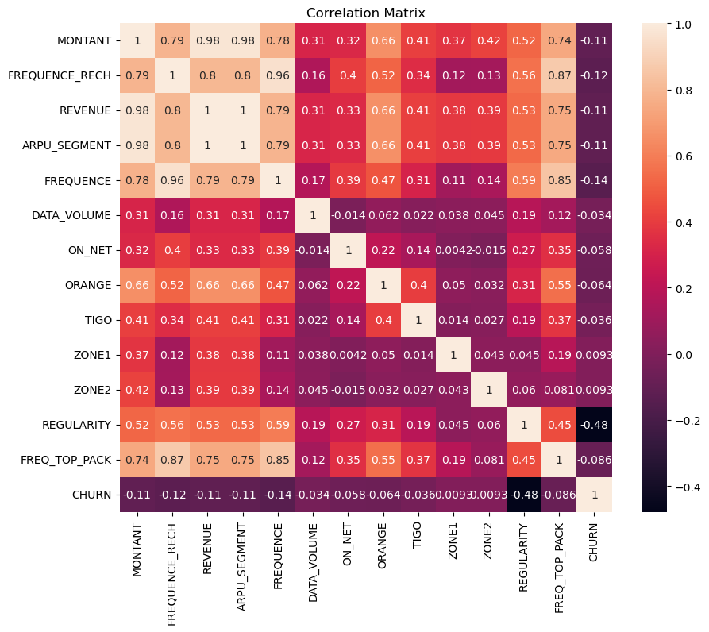
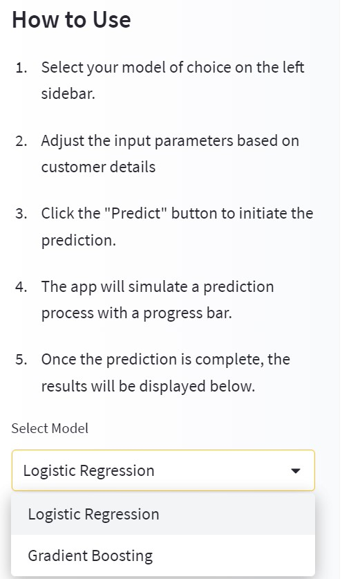

# Expresso-Telco-Churn-Classification

## Project Overview 🚀
The Expresso-Telco-Churn-Classification challenge focuses on developing a machine learning model for an African telecommunications company. The objective is to predict customer churn, which refers to customers becoming inactive and not making any transactions for 90 days. By identifying potential churners, the company can take proactive measures to retain customers and improve satisfaction.

<p align="center">
  
</p>


This solution will help this telecom company to better serve their customers by understanding which customers are at risk of leaving.


## Table of Contents

- [Project Overview](#project-overview)
- [Getting Started](#getting-started)
- [Data](#data)
- [Modeling](#modeling)
- [Evaluation](#evaluation)
- [Deployment](#deployment)
- [Contact](#contact)


## Objectives 🎯 :

- 📌 Objective 1: Data Exploration :mag_right:
- 📌 Objective 2: Data Preprocessing :gear:
- 📌 Objective 3: Model Selection and Training :computer:
- 📌 Objective 4: Model Evaluation and Optimization :chart_with_upwards_trend:
- 📌 Objective 5: Interpretation and Insights :bulb:
- 📌 Objective 6: Deployment and Future Improvements :rocket:


## Summary
| Code | Name                                                | Published Article                                                                                          | Deployed App                                                                                                 | Streamlit App                                                                                                |
|------|-----------------------------------------------------|------------------------------------------------------------------------------------------------------------|--------------------------------------------------------------------------------------------------------------|-------------------------------------------------------------------------------------------------------------|
| Capstone  | Churn Prediction Classification with FastAPI and Streamlit     | [Medium Article](https://medium.com/@alidu143/expresso-telcom-churn-prediction-classification-with-fastapi-and-streamlit-d54aa98675df) | [FastAPI App](https://abubakari-expresso-churn-prediction-fastapi.hf.space/docs) | [Streamlit App](https://abubakari-expresso-churn-prediction-streamlit.hf.space/)                    |


## Project Setup

To set up the project environment, follow these steps:

1. Clone the repository:

git clone my_github 

```bash 
https://github.com/aliduabubakari/Expresso-Telco-Churn-Classification.git
```

2. Install the required dependencies:

```bash
pip install -r requirements.txt
```

3. Create a virtual environment:

- **Windows:**
  ```bash
  python -m venv venv
  venv\Scripts\activate
  ```

- **Linux & MacOS:**
  ```bash
  python3 -m venv venv
  source venv/bin/activate
  ```

You can copy each command above and run them in your terminal to easily set up the project environment.


## Data

The data used in this project consists of a diverse collection of sepsis cases obtained from [Zindi](https://zindi.africa/competitions/customer-churn-prediction-challenge-for-azubian).

## Data Fields

| Column Name     | Data Features   | Description                                                              |
|-----------------|-----------------|--------------------------------------------------------------------------|
| REGION          | Categorical     | The location of each client                                               |
| TENURE          | Numeric         | Duration with the network                                                 |
| MONTANT         | Numeric         | Top-Up Amount                                                             |
| FREQUENCE_RECH  | Numeric         | The number of times a customer refilled                                    |
| REVENUE         | Numeric         | Monthly income of each client                                             |
| ARPU_SEGMENT    | Numeric         | Income over 90 days divided by 3                                          |
| FREQUENCE       | Numeric         | Number of times the client has made an income                              |
| DATA_VOLUME     | Numeric         | Number of connections                                                     |
| ON_NET          | Numeric         | Inter Expresso call                                                       |
| ORANGE          | Numeric         | Calls to Orange                                                           |
| TIGO            | Numeric         | Calls to Tigo                                                             |
| ZONE1           | Numeric         | Calls to Zone1                                                            |
| ZONE2           | Numeric         | Calls to Zone2                                                            |
| MRG             | Categorical     | A client who is going                                                      |
| REGULARITY      | Numeric         | Number of times the client is active for 90 days                           |
| TOP_PACK        | Categorical     | The most active packs                                                     |
| FREQ_TOP_PACK   | Numeric         | Number of times the client has activated the top pack packages             |
| CHURN           | Binary          | Target variable to predict - Churn (Positive: customer will churn, Negative: customer will not churn) |


## Exploratory Data Analysis

During the exploratory data analysis (EDA) phase, a comprehensive investigation of the churn dataset was conducted to gain insights through various types of analyses.

- **Univariate analysis:** A thorough examination of each variable individually was performed. Summary statistics such as mean, median, standard deviation, and quartiles were calculated to understand the central tendency and spread of the data.

<p align="center">
  
</p>

- **Bivariate analysis:** Relationships between pairs of variables were explored to identify patterns and potential predictor variables for sepsis classification.

<p align="center">
  
</p>

- **Multivariate analysis:** Relationships among multiple variables were examined simultaneously, allowing for a deeper understanding of their interactions and impact on sepsis.

<p align="center">
  
</p>

In addition to these exploratory analyses, hypotheses were formulated based on prior knowledge and existing research. Statistical tests such as t-tests, chi-square tests, or ANOVA tests were utilized to test these hypotheses, depending on the nature of the variables. The results of these tests validated or refuted the formulated hypotheses and provided further insights into the relationships between variables.


### Hypotheses:

<p align="center">
  
</p>


- **Hypothesis 1:** Higher plasma glucose levels (PRG) are associated with an increased risk of developing sepsis.

- **Hypothesis 2:** Abnormal blood work results, such as high values of PL, SK, and BD2, are indicative of a higher likelihood of sepsis.

- **Hypothesis 3:** Older patients are more likely to develop sepsis compared to younger patients.

- **Hypothesis 4:** Patients with higher body mass index (BMI) values (M11) have a lower risk of sepsis.

- **Hypothesis 5:** Patients without valid insurance cards are more likely to develop sepsis.

These hypotheses, along with the results of the EDA, contribute to a deeper understanding of the dataset and provide valuable insights for further analysis and model development.

### Business Questions:

## Modeling

During the modeling phase, the evaluation of models took into consideration the imbalanced nature of the data. The main metrics used to assess model performance were the F1 score and AUC score, which provide a balanced assessment for imbalanced datasets.

The following models were evaluated:

- **Logistic Regression** 
- **Decision Tree** 
- **Random Forest** 
- **Gaussian Naive Bayes**
- **Gradient boosting**
- **Cat boost** 
- **XGBoost**
- **ComplementNB**

These models were evaluated based on their AUC and logloss scores, providing insights into their performance on the imbalanced dataset. Below is the results;

<p align="center">
  
</p>


## Evaluation

<p align="center">
  
</p>


Given the imbalanced nature of our dataset, we assessed the models' performance using the AUC metric.

- Logistic Regression and GradientBoosting models emerged as the 🏆 top-performing models, achieving the highest AUC scores.
- ComplementNB consistently demonstrated high performance across different conditions.
- GaussianNB had a relatively lower AUC score and higher log loss compared to other models.
- XGBoost, CatBoost, and Random Forest models showed improved performance compared to previous conditions.
- Decision Tree model performed relatively poorer in terms of AUC score.


## Deployment

### Fastapi deployment 

1. Make sure you have FastAPI and any necessary dependencies installed. You can install FastAPI using pip:

```bash
pip install fastapi
```

2. Open a terminal or command prompt and navigate to the directory where your main.py file is located.

3. Run the FastAPI application using the uvicorn command, specifying the module and application name:

```bash
uvicorn main:app --reload
```
4. After running the command, you should see output indicating that the FastAPI application is running and listening on a specific address (e.g., http:localhost:8000). This address represents the API endpoint where you can access your application.

5. Open a web browser or use an API testing tool (e.g., Postman) to interact with your deployed FastAPI application. Use the API endpoint provided in the terminal to make requests and receive responses.

#### API Documentation
The API documentation provides details about the available endpoints, request and response formats, and example usage. You can access the documentation by visiting the /docs endpoint after starting the server (http://localhost:8000/docs).


### Containerized deployment 

To run the Docker container based on the provided Dockerfile, follow these steps:

1. Make sure you have Docker installed on your system.

2. Create a new file named Dockerfile (without any file extension) in the root directory of your project.

3. Copy the content of the Dockerfile you provided into the newly created Dockerfile.

4. Open a terminal or command prompt and navigate to the directory where the Dockerfile is located.

5. Build the Docker image by running the following command:

```bash
docker build -t your-image-name .
```

6. Replace your-image-name with the desired name for your Docker image. The . at the end denotes the current directory as the build context.

7. Once the image is built, you can run a Docker container based on that image using the following command:

```bash
docker run -d -p host-port:container-port your-image-name
```
Replace host-port with the port number on your host machine that you want to map to the container's port, and replace container-port with the port number specified in the Dockerfile's EXPOSE instruction (in this case, it's 8000).

For example, if you want to map the container's port 8000 to port 8080 on your host machine, the command would be:

```bash
docker run -d -p 8080:8000 your-image-name
```

8. After running the command, the Docker container will start, and your FastAPI application will be running inside the container.


9. You can access your application by visiting http://localhost:host-port in your web browser or using an API testing tool.

For example, if you mapped the container's port 8000 to your host's port 8080, you would access the application at http://localhost:8080.

### Streamlit deployment 

Navigate to the cloned repository and run the command:

```bash 
pip install -r requirements.txt
``` 
To run the demo app (being at the repository root), use the following command:
```bash 
streamlit run streamlit_app.py
```

##### App Execution on Huggingface

Here's a step-by-step process on how to use the [Streamlit App](https://abubakari-expresso-churn-prediction-streamlit.hf.space/) on Huggingface:


<p align="center">
  
</p>

<p align="center">
  
</p>

<p align="center">
  
</p>

<p align="center">
  
</p>

<p align="center">
  
</p>

<p align="center">
  
</p>

<p align="center">
  
</p>

<p align="center">
  
</p>

<p align="center">
  
</p>

##### Fastapi on Huggingface

Here's a step-by-step process on how to use the [FastAPI](https://abubakari-expresso-churn-prediction-fastapi.hf.space/docs) on Huggingface:


<p align="center">
  
</p>

<p align="center">
  
</p>

<p align="center">
  
</p>

<p align="center">
  
</p>

<p align="center">
  
</p>

## Contribution

Contributions and pull requests are welcome! If you would like to contribute to this project, please follow these steps:

1.Fork this repository.
2.Create a new branch with a descriptive name
3.Make your desired changes and commit them.
4.Push the branch to your forked repository
5.Open a pull request in this repository and describe your changes.

Feel free to contribute to different aspects of the project, including improving the model, exploring additional features, or enhancing the EDA.

## Contact

`Alidu Abubakari`

`Data Analyst`
`Azubi Africa`

- [](https://www.linkedin.com/in/alidu-abubakari-2612bb57/) 


